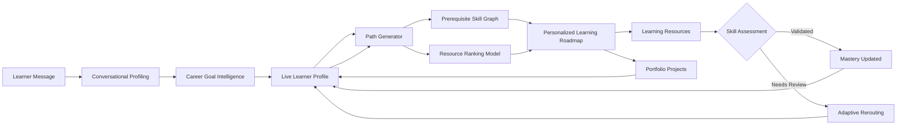

<div align="center">

# 🧭 SkillCompass

### Adaptive AI-powered career guidance and personalized learning paths

Turn a career goal into a **structured, prerequisite-aware learning journey** —
then continuously adapt that journey as skills are learned, projects are
completed, and assessments reveal what needs attention.


</div>

<br>

<p align="center">
  
</p>

---

# 🚀 What is SkillCompass?

SkillCompass is an **AI-driven adaptive learning-path recommendation system**
designed to help learners move from a career goal to a structured and
personalized learning journey.

Unlike a static roadmap generator, SkillCompass maintains a **live learner
state**. It considers what the learner already knows, which prerequisites are
missing, what they have completed, which projects they have built, and how they
perform in skill assessments.

The system combines:

* 🧠 **LLM-powered conversational profiling**
* 🎯 **Career-goal intelligence**
* 🕸️ **Prerequisite-aware skill graphs**
* 📊 **Personalized resource ranking**
* 🔍 **Grounded recommendation explanations**
* 📝 **Skill assessments and mastery tracking**
* 💼 **Portfolio project recommendations**
* 🔄 **Adaptive roadmap regeneration**

---

## From a simple goal to an adaptive journey

A learner can start with a simple statement:

> **"I want to become an MLOps Engineer."**

SkillCompass transforms that goal into an adaptive workflow:

```text
Career Goal
    │
    ▼
Career Goal Resolution
    │
    ▼
Learner Profile + Current Skills
    │
    ▼
Skill Gap & Prerequisite Analysis
    │
    ▼
Personalized Resource Ranking
    │
    ▼
Adaptive Learning Roadmap
    │
    ▼
Resources + Projects + Assessments
    │
    ▼
Updated Learner State
    │
    └──────────────► Future Roadmap Adapts
```

The roadmap is not generated once and forgotten.

As the learner progresses, their updated state influences what SkillCompass
recommends next.

---

# 💡 Why SkillCompass?

Most learning platforms provide a fixed sequence of courses.

SkillCompass is designed around a different principle:

> **The learning path should change when the learner changes.**

For example:

* A learner already knows Python → unnecessary beginner content can be avoided.
* A prerequisite is missing → it can be introduced before dependent skills.
* A learner fails a checkpoint → the skill can be marked for review.
* A learner completes a project → practical evidence is preserved.
* Learner progress changes → future recommendations are generated from the
  updated learner state.

SkillCompass focuses on answering:

> **What should this learner focus on next — and why?**

---

# ⚡ Core Capabilities

## 💬 Conversational Profiling

Learners can describe their goals and background naturally.

`/profile/chat` processes conversational input and extracts structured learner
information such as:

* Career goal
* Current skills
* Experience level
* Learning preferences
* Available weekly study time

Supported LLM providers include:

* **Groq**
* **OpenAI**
* **Mistral**

A deterministic local fallback supports the core application flow when an
external LLM provider is not configured.

The LLM helps interpret learner intent and communicate responses. The
underlying roadmap remains grounded in SkillCompass's career-goal registry,
skill graph, learner state, and recommendation pipeline.

---

## 🎯 Career-Goal Intelligence

SkillCompass supports **51 career goals** spanning:

* Data, Analytics & AI
* Software Engineering
* Cloud, Platform & Reliability
* IT, Support & Security
* Quality, Product & Design
* Specialized Engineering
* Technical & Business

The learner's natural-language goal is resolved against the supported
career-goal registry and connected to relevant skills and learning
requirements.

The complete list is available in the
[Supported Career Goals](#-supported-career-goals) section.

---

## 🕸️ Prerequisite-Aware Learning Paths

Skills are represented through a prerequisite graph built using
**NetworkX**.

Instead of recommending skills as an unrelated list:

```text
Python → Machine Learning → MLOps
```

SkillCompass considers dependencies and learner state before determining what
should come next.

`PathGenerator` identifies:

* Skills the learner already has
* Missing skills
* Required prerequisites
* A valid learning sequence

This helps create a roadmap that follows skill dependencies instead of simply
listing popular courses.

---

## 📊 Personalized Resource Ranking

Learning resources are ranked according to learner-specific and
resource-related signals.

Examples include:

* Learning-style compatibility
* Available study time
* Resource duration
* Current skill requirements
* Career-goal relevance

The ranking pipeline uses **LightGBM** to rank candidate learning resources.

Feature engineering is shared between training and serving to reduce the risk
of train/serve feature inconsistencies.

---

## 🔍 Grounded Recommendation Explanations

Recommendations should not feel like black boxes.

`/explain/{course_id}/{user_id}` provides explanations based on the strongest
factors influencing a recommendation.

The explanation pipeline can communicate:

* Why a resource was recommended
* Which learner or resource signals mattered
* How the recommendation relates to the learner's current path

Feature-attribution signals provide the underlying explanation, while the LLM
helps present the result in natural language.

The LLM does not independently invent the recommendation reasons.

---

## 📝 Assessments & Mastery Tracking

Skill checkpoints allow learners to validate their understanding.

Assessment outcomes update learner mastery states such as:

```text
validated
needs_review
```

These outcomes can influence future learning-path generation.

For example:

```text
Assessment Passed
        ↓
Skill Marked as Validated
        ↓
Dependent Skills Can Become Relevant
```

or:

```text
Assessment Needs Improvement
        ↓
Skill Marked as Needs Review
        ↓
Future Recommendations Can Adapt
```

---

## 💼 Portfolio Projects as Evidence

Learning a skill and demonstrating a skill are not the same thing.

SkillCompass connects relevant skills to practical portfolio projects through
the project catalog.

This allows the learner's progress to include different forms of evidence:

* 📚 Learning resources completed
* 📝 Skills validated through assessments
* 💼 Practical projects completed

This provides a richer representation of learner progress than resource
completion alone.

---

## 🔄 Adaptive Roadmap Regeneration

SkillCompass treats learner progress as dynamic.

When learner state changes:

* Skills may become validated
* Skills may require review
* Resources may be completed
* Projects may be completed
* Prerequisite gaps may change

The system can regenerate future recommendations from the learner's updated
state.

Historical progress remains preserved while the future part of the roadmap
adapts.

---

# 🔁 How the Adaptive Learning Loop Works



The adaptive loop powers learner-facing functionality such as:

* Next best action
* Skill gaps
* Skill mastery
* Learning milestones
* Personalized resource recommendations
* Assessment-driven roadmap updates

<p align="center">
  
</p>

---

# 🎯 Supported Career Goals

SkillCompass currently supports **51 career goals**.

<details>

<summary><strong>📊 Data, Analytics & AI — 14 Roles</strong></summary>

<br>

* Data Analyst
* Business Intelligence Analyst
* Data Scientist
* ML Engineer
* MLOps Engineer
* Machine Learning Researcher
* AI Engineer
* Computer Vision Engineer
* NLP Engineer
* Prompt Engineer
* Data Engineer
* Analytics Engineer
* Data Governance Analyst
* Data Privacy Engineer

</details>

<details>

<summary><strong>💻 Software Engineering — 8 Roles</strong></summary>

<br>

* Frontend Engineer
* Web Performance Engineer
* Backend Engineer
* Full-Stack Engineer
* Solutions Architect
* Growth Engineer
* Android Engineer
* iOS Engineer

</details>

<details>

<summary><strong>☁️ Cloud, Platform & Reliability — 7 Roles</strong></summary>

<br>

* Cloud Engineer
* Cloud Architect
* DevOps Engineer
* Site Reliability Engineer
* Platform Engineer
* Infrastructure Engineer
* Release Engineer

</details>

<details>

<summary><strong>🔐 IT, Support & Security — 7 Roles</strong></summary>

<br>

* Systems Administrator
* IT Support Specialist
* Technical Support Engineer
* Network Engineer
* Security Engineer
* Penetration Tester
* Database Administrator

</details>

<details>

<summary><strong>🎨 Quality, Product & Design — 5 Roles</strong></summary>

<br>

* QA Engineer
* Product Manager
* Scrum Master
* UX Designer
* UI Designer

</details>

<details>

<summary><strong>⚙️ Specialized Engineering — 5 Roles</strong></summary>

<br>

* Game Developer
* Embedded Systems Engineer
* Robotics Engineer
* AR/VR Developer
* Blockchain Developer

</details>

<details>

<summary><strong>📈 Technical & Business — 5 Roles</strong></summary>

<br>

* Technical Writer
* Digital Marketing Analyst
* SEO Specialist
* Salesforce Developer
* ERP Consultant

</details>

The career-goal registry keeps role intelligence data-driven.

Career paths can be connected to relevant skills, prerequisites, learning
requirements, and recommendations without requiring the core application logic
to be redesigned for every supported role.

---

# 🏗️ Architecture & Technology Stack

| Layer            | Technology                    | Purpose                                                                          |
| ---------------- | ----------------------------- | -------------------------------------------------------------------------------- |
| API              | **FastAPI + Pydantic v2**     | Handles profiling, learning paths, explanations, assessments, and learner state. |
| Ranking Model    | **LightGBM**                  | Ranks candidate learning resources.                                              |
| Explainability   | **SHAP**                      | Supports feature-attribution-based explanations.                                 |
| Text Processing  | **TF-IDF + SVD**              | Text representation and retrieval-related functionality.                         |
| Skill Graph      | **NetworkX DiGraph**          | Represents skill prerequisites and dependencies.                                 |
| LLM Providers    | **Groq / OpenAI / Mistral**   | Conversational profiling and natural-language responses.                         |
| Fallback         | **Deterministic Local Logic** | Supports core flows without external LLM credentials.                            |
| Profile Storage  | **JSON**                      | Current local/demo persistence for learner state.                                |
| Testing          | **pytest / unittest**         | Unit and integration testing.                                                    |
| Code Quality     | **Ruff**                      | Linting and static code-quality checks.                                          |
| Containerization | **Docker**                    | Reproducible application packaging.                                              |

---

# 📂 Repository Structure

```text
SkillCompass/
│
├── api/
│   ├── main.py
│   │
│   ├── routers/
│   │   ├── profile_router.py
│   │   ├── path_router.py
│   │   ├── explain_router.py
│   │   ├── assessment_router.py
│   │   └── learning_router.py
│   │
│   ├── schemas/
│   │
│   └── static/
│       └── index.html
│
├── src/
│   └── recommender/
│       │
│       ├── components/
│       │   ├── data_ingestion.py
│       │   ├── data_validation.py
│       │   ├── data_transformation.py
│       │   ├── model_trainer.py
│       │   ├── model_evaluator.py
│       │   ├── skill_graph_builder.py
│       │   ├── path_generator.py
│       │   └── explainer.py
│       │
│       ├── pipeline/
│       │   ├── training_pipeline.py
│       │   ├── prediction_pipeline.py
│       │   └── adaptive_rerouting_pipeline.py
│       │
│       ├── llm/
│       │   ├── llm_client.py
│       │   ├── rag_engine.py
│       │   ├── conversation_manager.py
│       │   └── profile_store.py
│       │
│       ├── utils/
│       │   └── feature_engineering.py
│       │
│       ├── entity/
│       │
│       ├── goal_intelligence.py
│       ├── assessment_engine.py
│       └── project_catalog.py
│
├── data/
│   └── seed/
│
├── artifacts/
│
├── config/
│
├── docs/
│   └── assets/
│       ├── dashboard-overview.png
│       └── adaptive-trail.png
│
├── tests/
│   ├── unit/
│   └── integration/
│
├── Dockerfile
├── docker-compose.yaml
├── requirements.txt
├── params.yaml
├── DEPLOYMENT.md
└── README.md
```

---

# 🔌 API Surface

| Method | Endpoint                                   | Purpose                                                    |
| ------ | ------------------------------------------ | ---------------------------------------------------------- |
| `POST` | `/profile/chat`                            | Process conversational learner profiling and update state. |
| `GET`  | `/profile/{user_id}`                       | Retrieve a learner profile.                                |
| `POST` | `/path/generate`                           | Generate a personalized learning roadmap.                  |
| `GET`  | `/explain/{course_id}/{user_id}`           | Explain why a resource was recommended.                    |
| `GET`  | `/assessment/{skill_id}`                   | Retrieve assessment questions for a skill.                 |
| `POST` | `/assessment/submit`                       | Submit and evaluate an assessment.                         |
| `GET`  | `/learning/state/{user_id}`                | Retrieve learner progress and mastery state.               |
| `GET`  | `/learning/projects/{skill_id}`            | Retrieve projects associated with a skill.                 |
| `POST` | `/learning/projects/{skill_id}/complete`   | Record project completion.                                 |
| `POST` | `/learning/resources/{course_id}/complete` | Record learning-resource completion.                       |
| `GET`  | `/health`                                  | Check application health and status.                       |

---

# 🧠 Recommendation & Learning Pipeline

The recommendation workflow is designed around a structured pipeline:

```text
Learner Profile
      +
Career Goal
      +
Current Skills
      +
Skill Prerequisites
      ↓
Skill Gap Analysis
      ↓
Candidate Resource Selection
      ↓
Feature Engineering
      ↓
LightGBM Ranking
      ↓
Personalized Recommendations
      ↓
Feature Attribution / Explanation
```

The learner's updated progress can then influence the next recommendation cycle.

---

# 📊 Data, Training & Evaluation

## Leakage-Aware Evaluation

Training and evaluation data are separated before evaluating learner-dependent
recommendation signals.

The objective is to reduce the risk of evaluating the model using information
that would not have been available when making the original recommendation.

---

## Chronological Learning Features

Learning-event features are designed around event ordering.

Historical learner state should be constructed from information available before
the relevant learning event rather than future outcomes.

---

## Shared Feature Engineering

Feature engineering logic is centralized to reduce the risk of training and
serving using different feature definitions.

```text
Training Data
      ↓
Feature Engineering
      ↓
Model Training
      ↓
Saved Model
      ↓
Serving
      ↓
Same Feature Logic
```

---

# 🚀 Getting Started

## 1️⃣ Clone the repository

```bash
git clone <your-repository-url>
cd SkillCompass
```

## 2️⃣ Create and activate a virtual environment

### Windows

```bash
python -m venv venv
venv\Scripts\activate
```

### macOS / Linux

```bash
python3 -m venv venv
source venv/bin/activate
```

---

## 3️⃣ Install dependencies

```bash
pip install -r requirements.txt
```

---

## 4️⃣ Configure environment variables

Create a `.env` file in the project root:

```env
# API keys for supported LLM providers
GROQ_API_KEY=your_groq_api_key
OPENAI_API_KEY=your_openai_api_key
MISTRAL_API_KEY=your_mistral_api_key

# Select the active LLM provider
LLM_PROVIDER=groq
```

### Supported LLM providers

Set `LLM_PROVIDER` to the provider you want to use:

```env
LLM_PROVIDER=groq
```

```env
LLM_PROVIDER=openai
```

```env
LLM_PROVIDER=mistral
```

Only configure the API key required for the provider you select.

For example, using **Mistral**:

```env
MISTRAL_API_KEY=your_mistral_api_key
LLM_PROVIDER=mistral
```

If your application supports deterministic fallback behavior, the fallback can
be used when an external provider is unavailable or not configured, depending
on the application's LLM configuration logic.


## 5️⃣ Run the training pipeline

```bash
python main.py
```

This prepares the required pipeline artifacts used by the application.

---

## 6️⃣ Run tests

```bash
pytest
```

or:

```bash
python -m unittest discover tests
```

---

## 7️⃣ Start the application

```bash
uvicorn api.main:app --reload
```

Open:

```text
http://127.0.0.1:8000/
```

---

# 🐳 Docker

Build and run the application:

```bash
docker compose up --build
```

---

# ⚙️ Configuration

Configuration and model parameters can control values such as:

| Parameter                     | Purpose                                            |
| ----------------------------- | -------------------------------------------------- |
| `score_threshold`             | Ranking/evaluation threshold.                      |
| `top_k_features`              | Number of important attribution signals returned.  |
| `min_confidence`              | Minimum confidence for recommendations.            |
| `max_path_length`             | Maximum skills considered in a generated path.     |
| `candidate_courses_per_skill` | Maximum resources evaluated per skill.             |
| `svd_components`              | Dimensionality of the TF-IDF + SVD representation. |
| `model_params.*`              | Ranking-model hyperparameters.                     |

---

# 🧪 Testing

Run the complete test suite:

```bash
pytest
```

or:

```bash
python -m unittest discover tests
```

The testing workflow covers areas such as:

* Data validation
* Feature engineering
* Skill graph behavior
* Learning-path generation
* Conversational profiling
* LLM provider abstraction
* Local fallback behavior
* Assessment workflows
* Adaptive rerouting
* API routes
* Ranking and evaluation

---

# 🚀 Deployment Notes

## Current Implementation

SkillCompass currently uses:

```text
artifacts/live_profiles.json
```

for local learner-profile persistence.

The current persistence implementation is suitable for:

* Local development
* Demonstrations
* Single-instance usage

It is **not a production database** and is not intended for:

* Multi-instance synchronization
* High-concurrency workloads
* Distributed production deployments

---

# 🔮 Future Scope

SkillCompass currently focuses on adaptive learning paths, personalized resource
ranking, learner-state tracking, assessments, and career-goal guidance.

The following areas represent potential future improvements.

## 🗄️ Production-Ready Persistence

Future versions can replace JSON-based local persistence with:

* PostgreSQL for structured application data
* Redis for caching and shared application state
* Scalable multi-instance persistence
* Improved concurrent access handling

---

## 📈 Stronger Personalization

Future recommendation models can incorporate richer learner signals such as:

* Historical learning behavior
* Resource completion patterns
* Assessment performance over time
* Explicit learner feedback
* Long-term career progress

This can help recommendations become increasingly personalized.

---

## 🤖 Enhanced AI Assistance

The AI layer can be expanded to support:

* Context-aware learning guidance
* Personalized study-plan adjustments
* Learning-resource question answering
* Improved recommendation explanations
* Intelligent progress summaries

AI-generated responses should continue to remain grounded in learner state and
application data.

---

## 📚 Expanded Learning Content

Future versions can expand:

* Learning-resource coverage
* Assessment question banks
* Skill checkpoints
* Portfolio projects
* Skill-to-career mappings

This can improve depth and coverage across supported career paths.

---

## 🔄 Continuous Recommendation Improvement

Future versions can introduce stronger feedback loops for improving
recommendation quality.

Potential improvements include:

* Feedback-driven ranking updates
* Periodic model retraining
* Recommendation-quality monitoring
* A/B testing recommendation strategies
* Improved adaptive learning metrics

---

## ☁️ Scalable Deployment

The application can evolve toward a production architecture with:

* Cloud deployment
* CI/CD automation
* Centralized logging
* Monitoring and observability
* Performance monitoring
* Health monitoring
* Scalable multi-instance deployment

---

## 📊 Advanced Learner Analytics

Future dashboards could provide deeper insights into:

* Skill mastery progression
* Learning consistency
* Weak skill areas
* Career readiness
* Learning milestones
* Recommendation effectiveness

---

## 🎯 Career Readiness Insights

A future version could combine validated skills, completed projects, and
learning progress to provide higher-level career guidance.

Potential features include:

* Career readiness indicators
* Skill-gap summaries
* Portfolio completeness
* Suggested next milestones
* Role-specific preparation guidance

---

# 🛣️ Roadmap

* [ ] Expand skill-to-career mappings
* [ ] Increase learning-resource coverage
* [ ] Expand assessment question banks
* [ ] Add more portfolio projects
* [ ] Improve recommendation feedback signals
* [ ] Add production-ready database persistence
* [ ] Improve observability and monitoring
* [ ] Add CI/CD automation
* [ ] Support scalable multi-instance deployment

---

<div align="center">

# 🧭 Adaptive learning, not static roadmaps.

A learner's career goal may remain the same.

Their **skills, progress, projects, assessment results, and available time**
do not.

### SkillCompass adapts the learning journey accordingly.

</div>

---

<div align="center">

⭐ If you found SkillCompass interesting, consider giving the repository a star.

</div>
