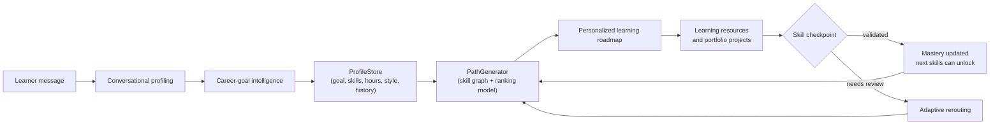

<div align="center">

# 🧭 SkillCompass

**An AI-driven, adaptive learning-path recommender that turns a natural-language
career goal into a prerequisite-aware, personalized roadmap — and continuously
re-ranks that roadmap as the learner's profile, progress, projects, and
assessment results change.**


</div>

<br>

<p align="center">
  
</p>

---

## What this actually is

SkillCompass is a **hybrid learning-path recommender**, not a wrapper around a
chatbot.

A FastAPI backend combines a **career-goal intelligence layer**, a
**prerequisite skill graph**, a **trained ranking model**, and a
**grounded explanation system** to determine what a learner should focus on
next and why.

The LLM is deliberately scoped to natural-language interaction and profile
understanding. It does not independently invent learning paths or arbitrary
career/skill identifiers. Career goals, skills, prerequisites, learning state,
and recommendation logic remain grounded in the application's data and
pipeline.

The platform supports a learner workflow such as:

```text
"I want to become an MLOps engineer"
        ↓
Career-goal resolution
        ↓
Current skill and profile analysis
        ↓
Prerequisite-aware skill-gap analysis
        ↓
Personalized resource ranking
        ↓
Adaptive learning roadmap
        ↓
Projects + assessments + progress updates
        ↓
Roadmap regenerated from current learner state
```

SkillCompass is designed around **adaptive learner state** rather than a
one-time generated roadmap. As learners complete resources, build projects,
validate skills, or fail checkpoints, their current state influences future
recommendations.

---

## Table of contents

* [Core capabilities](#core-capabilities)
* [How the adaptive loop works](#how-the-adaptive-loop-works)
* [Supported career goals](#supported-career-goals)
* [Architecture & stack](#architecture--stack)
* [Repository layout](#repository-layout)
* [API surface](#api-surface)
* [Data, training & evaluation guarantees](#data-training--evaluation-guarantees)
* [Getting started](#getting-started)
* [Configuration reference](#configuration-reference)
* [Testing](#testing)
* [Deployment notes](#deployment-notes)
* [Roadmap](#roadmap)

---

## Core capabilities

### Conversational profiling

`/profile/chat` accepts natural-language learner input and resolves relevant
profile information such as career goals, skills, experience, learning
preferences, and available study time.

The conversational layer is used to understand learner intent and map it to
the application's supported career and skill intelligence.

An `LLMClient` can use Groq or OpenAI when credentials are configured, while a
deterministic local fallback keeps the core flow usable without external API
credentials.

The resolved learner information is persisted and used by future roadmap
generation rather than being treated as a one-time conversation.

---

### Support for 51 career goals

SkillCompass supports **51 career goals** across:

* Data, Analytics & AI
* Software Engineering
* Cloud, Platform & Reliability
* IT, Support & Security
* Quality, Product & Design
* Specialized Engineering
* Technical & Business

The career-goal system connects a learner's target role with relevant skills,
prerequisites, learning resources, and personalized recommendations.

See the complete list in [Supported career goals](#supported-career-goals).

---

### Prerequisite-aware pathing

`PathGenerator` works with the skill graph to identify the learner's current
skill gaps and prerequisite requirements before generating a roadmap.

The path-generation process considers:

* the learner's selected career goal,
* current and validated skills,
* prerequisite relationships,
* current learning state,
* candidate learning resources,
* personalized ranking signals.

This prevents the platform from treating a roadmap as a flat list of unrelated
courses.

---

### Adaptive rerouting without rewriting history

When learner progress changes, SkillCompass can regenerate the roadmap using
the learner's **current state**.

For example, if a learner does not meet the required mastery threshold during a
checkpoint:

* the skill can be marked as needing review,
* previously completed history remains preserved,
* the skill can reappear in future recommendations,
* prerequisite relationships continue to influence subsequent steps.

The goal is to adapt future recommendations without destroying the learner's
actual learning history.

---

### Personalized resource ranking

The recommendation pipeline uses learner-specific features when ranking
candidate learning resources.

These signals can include:

* learning-style fit,
* available weekly study time,
* resource duration,
* learner profile information,
* career and skill requirements.

Feature engineering is shared between training and serving to reduce the risk
of train/serve feature drift.

---

### Grounded explanations

`/explain/{course_id}/{user_id}` provides an explanation for a recommendation
using model or baseline feature-attribution signals.

Natural-language generation is used to communicate the explanation, while the
underlying recommendation reasons remain grounded in the ranking and
attribution pipeline.

---

### Real checkpoints and mastery state

Skill checkpoints are used to evaluate learner understanding.

Assessment outcomes update the learner's mastery state, allowing the platform
to distinguish between skills that are:

* `validated`
* `needs_review`

This state contributes to future learning-path generation and dashboard
progress views.

---

### Portfolio projects as evidence

Skills can be connected to practical portfolio projects through
`project_catalog.py`.

This separates different forms of learner progress:

* consuming learning resources,
* completing practical activities,
* validating understanding through assessments,
* building portfolio evidence.

The platform therefore treats **learning** and **building** as different
signals rather than assuming that resource completion alone demonstrates
mastery.

---

### A live, stateful learner profile

`ProfileStore` persists learner information and activity state, including
information such as:

* career goal,
* experience level,
* learning preferences,
* weekly study hours,
* self-reported skills,
* assessment-validated mastery,
* completed learning resources,
* project evidence,
* learner history.

Roadmaps are generated from the learner's current state rather than from a
single static profile snapshot.

---

## How the adaptive loop works



The adaptive loop powers learner-facing functionality such as:

* next best action,
* skill mastery and gaps,
* milestone progress,
* learning recommendations,
* assessment-driven roadmap updates.

---

<p align="center">
  
</p>

---

## Supported career goals

SkillCompass currently supports **51 career goals**.

<details>

<summary><strong>View all supported career goals</strong></summary>

<br>

### Data, Analytics & AI

* Data Analyst
* Business Intelligence Analyst
* Data Scientist
* ML Engineer
* MLOps Engineer
* Machine Learning Researcher
* AI Engineer
* Computer Vision Engineer
* NLP Engineer
* Prompt Engineer
* Data Engineer
* Analytics Engineer
* Data Governance Analyst
* Data Privacy Engineer

### Software Engineering

* Frontend Engineer
* Web Performance Engineer
* Backend Engineer
* Full-Stack Engineer
* Solutions Architect
* Growth Engineer
* Android Engineer
* iOS Engineer

### Cloud, Platform & Reliability

* Cloud Engineer
* Cloud Architect
* DevOps Engineer
* Site Reliability Engineer
* Platform Engineer
* Infrastructure Engineer
* Release Engineer

### IT, Support & Security

* Systems Administrator
* IT Support Specialist
* Technical Support Engineer
* Network Engineer
* Security Engineer
* Penetration Tester
* Database Administrator

### Quality, Product & Design

* QA Engineer
* Product Manager
* Scrum Master
* UX Designer
* UI Designer

### Specialized Engineering

* Game Developer
* Embedded Systems Engineer
* Robotics Engineer
* AR/VR Developer
* Blockchain Developer

### Technical & Business

* Technical Writer
* Digital Marketing Analyst
* SEO Specialist
* Salesforce Developer
* ERP Consultant

</details>

The career-goal registry is designed to keep role intelligence data-driven.
Career goals can be associated with relevant skills and learning requirements
without requiring the core recommendation pipeline to be rewritten for every
new role.

---

## Architecture & stack

| Layer               | Technology                         | Notes                                                                                          |
| ------------------- | ---------------------------------- | ---------------------------------------------------------------------------------------------- |
| API                 | **FastAPI** + Pydantic v2          | API routers handle profiling, path generation, explanations, assessments, and learner state.   |
| Ranking model       | **LightGBM**                       | Used for ranking candidate learning resources.                                                 |
| Explainability      | **SHAP**                           | Used to support feature-attribution-based recommendation explanations.                         |
| Text processing     | **TF-IDF + SVD**                   | Used for text representation and retrieval-related functionality.                              |
| Skill graph         | **NetworkX** DiGraph               | Represents prerequisite relationships between skills and supports graph-based path generation. |
| Conversational LLM  | **Groq** / **OpenAI**              | Optional providers for natural-language interaction when credentials are configured.           |
| Local fallback      | Deterministic local implementation | Allows core functionality to remain usable without external API credentials.                   |
| Learner persistence | JSON file                          | Current local/demo persistence for learner profiles and state.                                 |
| Testing             | **pytest**, `unittest`             | Unit and integration testing across core application functionality.                            |
| Code quality        | **Ruff**                           | Linting and code-quality checks.                                                               |
| Packaging           | Docker                             | Containerized application setup.                                                               |

### Current persistence status

The current application uses:

```text
artifacts/live_profiles.json
```

for local learner-profile persistence.

This is intentionally suitable for:

* local development,
* demonstrations,
* single-instance usage.

It is **not currently a production database implementation** and is not
intended to provide multi-instance or high-concurrency persistence.

PostgreSQL, pgvector, and Redis may be used as part of a future production
architecture, but they should not be interpreted as currently connected to the
running application unless the implementation is added.

---

## Repository layout

```text
SkillCompass/
├── api/
│   ├── main.py
│   ├── routers/
│   │   ├── profile_router.py
│   │   ├── path_router.py
│   │   ├── explain_router.py
│   │   ├── assessment_router.py
│   │   └── learning_router.py
│   ├── schemas/
│   └── static/
│       └── index.html
│
├── src/
│   └── recommender/
│       ├── components/
│       │   ├── data_ingestion.py
│       │   ├── data_validation.py
│       │   ├── data_transformation.py
│       │   ├── model_trainer.py
│       │   ├── model_evaluator.py
│       │   ├── skill_graph_builder.py
│       │   ├── path_generator.py
│       │   └── explainer.py
│       │
│       ├── pipeline/
│       │   ├── training_pipeline.py
│       │   ├── prediction_pipeline.py
│       │   └── adaptive_rerouting_pipeline.py
│       │
│       ├── llm/
│       │   ├── llm_client.py
│       │   ├── rag_engine.py
│       │   ├── conversation_manager.py
│       │   └── profile_store.py
│       │
│       ├── entity/
│       ├── utils/
│       │   └── feature_engineering.py
│       │
│       ├── goal_intelligence.py
│       ├── assessment_engine.py
│       └── project_catalog.py
│
├── data/
│   └── seed/
│
├── artifacts/
│
├── config/
│   └── config.yaml
│
├── docs/
│   └── assets/
│       ├── dashboard-overview.png
│       └── adaptive-trail.png
│
├── tests/
│   ├── unit/
│   └── integration/
│
├── Dockerfile
├── docker-compose.yaml
├── requirements.txt
├── params.yaml
├── DEPLOYMENT.md
└── README.md
```

---

## API surface

| Method & path                                   | Purpose                                                                            |
| ----------------------------------------------- | ---------------------------------------------------------------------------------- |
| `POST /profile/chat`                            | Process a conversational learner-profiling turn and update relevant learner state. |
| `GET /profile/{user_id}`                        | Fetch the persisted learner profile.                                               |
| `POST /path/generate`                           | Generate a personalized, prerequisite-aware learning roadmap.                      |
| `GET /explain/{course_id}/{user_id}`            | Return a grounded explanation for a recommendation.                                |
| `GET /assessment/{skill_id}`                    | Fetch checkpoint questions for a skill.                                            |
| `POST /assessment/submit`                       | Submit and evaluate a skill checkpoint.                                            |
| `GET /learning/state/{user_id}`                 | Return learner progress, skill mastery, and related dashboard state.               |
| `GET /learning/projects/{skill_id}`             | Fetch project recommendations associated with a skill.                             |
| `POST /learning/projects/{skill_id}/complete`   | Record portfolio-project completion.                                               |
| `POST /learning/resources/{course_id}/complete` | Record learning-resource completion.                                               |
| `GET /health`                                   | Report application health and relevant backend/artifact status.                    |

---

## Data, training & evaluation guarantees

### Leakage-aware evaluation

The training and evaluation pipeline is designed to separate training and
evaluation data before user-dependent learning signals are used for model
evaluation.

The goal is to avoid evaluating a model on information that would not have
been available at prediction time.

---

### Chronological learning features

Learning-event features are constructed with event ordering in mind.

For a learner event at time `T`, historical learner state should be derived
from information available before that point rather than future outcomes.

This is important for preventing future-learning information from leaking into
training features.

---

### Validation and model evaluation

The pipeline includes validation and evaluation stages before serving model
artifacts are used.

Model quality can be evaluated using ranking metrics and configured thresholds
before promoting candidate artifacts.

---

### Shared train/serve feature logic

Feature engineering is centralized so that training and serving use the same
core feature contract.

This reduces the risk of feature mismatches between:

```text
Training
   ↓
Saved model
   ↓
Prediction / ranking
```

---

## Getting started

### 1. Install dependencies

```bash
pip install -r requirements.txt
```

### 2. Configure environment variables

```bash
cp .env.example .env
```

Optionally configure an LLM provider:

```env
GROQ_API_KEY=your_key
```

or:

```env
OPENAI_API_KEY=your_key
```

When external credentials are not configured, the application can use its
deterministic local fallback for supported flows.

---

### 3. Run the pipeline

```bash
python main.py
```

This prepares the required pipeline artifacts and trains the recommendation
components used by the application.

---

### 4. Run tests

```bash
pytest
```

or:

```bash
python -m unittest discover tests
```

---

### 5. Start the API

```bash
uvicorn api.main:app --reload
```

Open:

```text
http://127.0.0.1:8000/
```

---

## Docker

Build and run the application:

```bash
docker compose up --build
```

---

## Configuration reference

Project behavior is controlled through configuration and parameter files.

Examples of configurable values include:

| Key                           | Controls                                                         |
| ----------------------------- | ---------------------------------------------------------------- |
| `score_threshold`             | Ranking/evaluation threshold used by the model pipeline.         |
| `top_k_features`              | Number of feature-attribution signals returned by the explainer. |
| `min_confidence`              | Minimum confidence used when selecting recommendations.          |
| `max_path_length`             | Maximum number of skills considered in a generated path.         |
| `candidate_courses_per_skill` | Maximum candidate resources evaluated for a skill.               |
| `svd_components`              | Dimensionality used by the TF-IDF + SVD text representation.     |
| `model_params.*`              | Ranking-model hyperparameters.                                   |

---

## Testing

Run the complete test suite:

```bash
pytest
```

or:

```bash
python -m unittest discover tests
```

The test suite covers core areas such as:

* data validation,
* feature engineering,
* skill-graph behavior,
* path generation,
* conversational profiling,
* assessment workflows,
* adaptive rerouting,
* API routes,
* ranking and evaluation behavior.

---

## Deployment notes

### Current state

* Learner profiles currently use **JSON-based local persistence**.
* The application is suitable for local development and demonstration.
* External LLM providers are optional when supported API credentials are configured.
* Deterministic local fallbacks support development without requiring external credentials.

### Production considerations

The current JSON persistence layer should be replaced before deploying the
application in a multi-instance or high-concurrency production environment.

Potential future production components include:

* PostgreSQL for structured persistence,
* pgvector for vector-based capabilities where required,
* Redis for caching and shared/distributed state.

See [`DEPLOYMENT.md`](DEPLOYMENT.md) for deployment-specific notes.

---

## Roadmap

* Expand and refine skill-to-career mappings across the supported career goals.
* Improve learning-resource coverage and recommendation quality.
* Expand the checkpoint question bank and project catalog.
* Add richer learner-feedback signals to the ranking pipeline.
* Replace JSON-based local persistence with production-ready database storage.
* Add scalable multi-instance deployment support.
* Introduce caching and shared application state where required for production workloads.
* Continue improving evaluation, observability, and deployment automation.

---

<div align="center">

## Built for adaptive learning, not static roadmaps.

A learner's goal may stay the same.

Their skills, progress, failures, projects, and available time do not.

**SkillCompass adapts the roadmap accordingly. 🧭**

</div>
