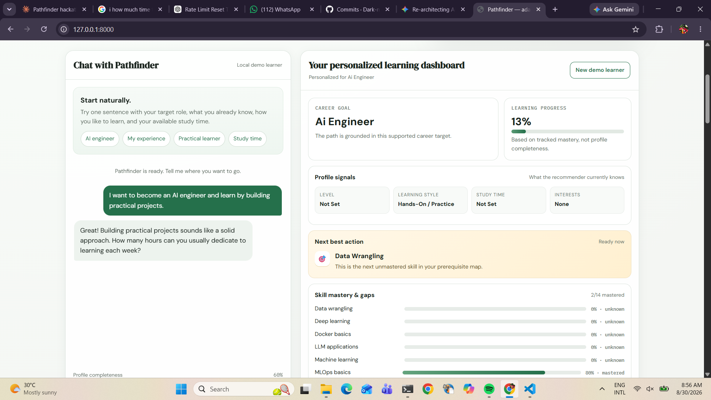
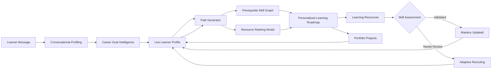
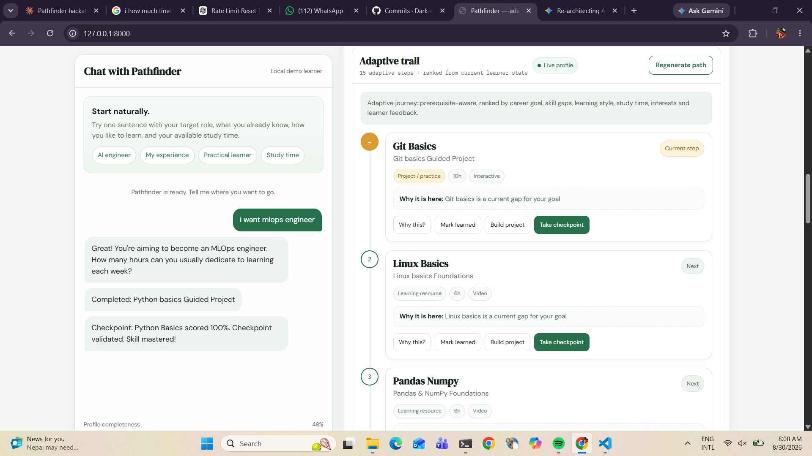
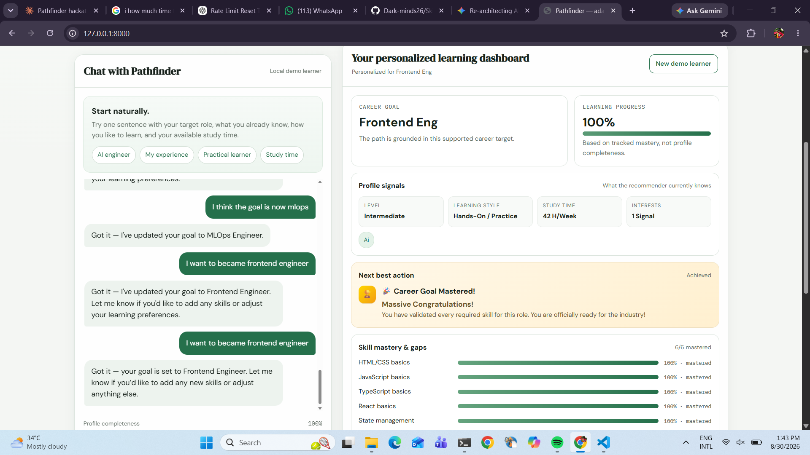

<div align="center">

# 🧭 SkillCompass

### Adaptive AI-powered career guidance and personalized learning paths

Turn a career goal into a **structured, prerequisite-aware learning journey** that adapts as skills are learned, projects are completed, and assessments reveal what needs attention.


</div>

<br>

<p align="center">
  
</p>

<p align="center">
  <i>Personalized learner dashboard with progress, career guidance, and next actions.</i>
</p>

---

# 🚀 What is SkillCompass?

**SkillCompass** is an AI-driven adaptive learning-path recommendation system that helps learners move from a career goal to a structured and personalized learning journey.

Unlike a static roadmap generator, SkillCompass maintains a **live learner state** and considers:

- 🎯 Career goals
- 🧠 Existing skills and experience
- 🕸️ Missing prerequisites
- 📚 Learning preferences
- ⏱️ Available study time
- 📝 Assessment results
- 💼 Completed projects
- 📊 Skill mastery and progress

> **The learning path should adapt when the learner changes.**

---

# ⚡ Core Capabilities

SkillCompass combines:

- 💬 LLM-powered conversational profiling
- 🎯 Career-goal intelligence
- 🕸️ Prerequisite-aware skill graphs
- 📊 Personalized resource ranking with LightGBM
- 🔍 Grounded recommendation explanations
- 📝 Skill assessments and mastery tracking
- 💼 Portfolio project recommendations
- 🔄 Adaptive roadmap regeneration

---

# 🔁 From Goal to Adaptive Journey

A learner can start with a simple goal:

> **"I want to become an MLOps Engineer."**

SkillCompass transforms it into:

```text
Career Goal
    │
    ▼
Career Goal Resolution
    │
    ▼
Learner Profile + Current Skills
    │
    ▼
Skill Gap & Prerequisite Analysis
    │
    ▼
Personalized Resource Ranking
    │
    ▼
Adaptive Learning Roadmap
    │
    ▼
Resources + Projects + Assessments
    │
    ▼
Updated Learner State
    │
    └──────────────► Future Roadmap Adapts
```

The roadmap is not generated once and forgotten. As the learner progresses, the updated learner state influences future recommendations.

---

# 💬 Conversational Profiling

Learners can describe their goals and background naturally.

The profiling flow extracts structured information such as:

- Career goal
- Current skills
- Experience level
- Learning preferences
- Available study time
- Interests

Example:

```text
"I want to become an MLOps Engineer.
I know Python and prefer hands-on learning.
I can study 7 hours per week."
```

## Supported LLM Providers

- **Groq**
- **OpenAI**
- **Mistral**

A deterministic local fallback supports core application flows when an external LLM provider is unavailable.

The LLM is used for **intent interpretation and natural-language interaction**. Core roadmap decisions remain grounded in the career registry, skill graph, learner state, and recommendation pipeline.

---

# 🎯 Career-Goal Intelligence

SkillCompass currently supports **51 career goals** across data, AI, software engineering, cloud, security, design, and other technical domains.

Natural-language goals are resolved against a supported career-goal registry and connected to relevant skills, prerequisites, and learning requirements.

## Supported Career Goals

<details>
<summary><strong>📊 Data, Analytics & AI — 14 Roles</strong></summary>

<br>

- Data Analyst
- Business Intelligence Analyst
- Data Scientist
- ML Engineer
- MLOps Engineer
- Machine Learning Researcher
- AI Engineer
- Computer Vision Engineer
- NLP Engineer
- Prompt Engineer
- Data Engineer
- Analytics Engineer
- Data Governance Analyst
- Data Privacy Engineer

</details>

<details>
<summary><strong>💻 Software Engineering — 8 Roles</strong></summary>

<br>

- Frontend Engineer
- Web Performance Engineer
- Backend Engineer
- Full-Stack Engineer
- Solutions Architect
- Growth Engineer
- Android Engineer
- iOS Engineer

</details>

<details>
<summary><strong>☁️ Cloud, Platform & Reliability — 7 Roles</strong></summary>

<br>

- Cloud Engineer
- Cloud Architect
- DevOps Engineer
- Site Reliability Engineer
- Platform Engineer
- Infrastructure Engineer
- Release Engineer

</details>

<details>
<summary><strong>🔐 IT, Support & Security — 7 Roles</strong></summary>

<br>

- Systems Administrator
- IT Support Specialist
- Technical Support Engineer
- Network Engineer
- Security Engineer
- Penetration Tester
- Database Administrator

</details>

<details>
<summary><strong>🎨 Quality, Product & Design — 5 Roles</strong></summary>

<br>

- QA Engineer
- Product Manager
- Scrum Master
- UX Designer
- UI Designer

</details>

<details>
<summary><strong>⚙️ Specialized Engineering — 5 Roles</strong></summary>

<br>

- Game Developer
- Embedded Systems Engineer
- Robotics Engineer
- AR/VR Developer
- Blockchain Developer

</details>

<details>
<summary><strong>📈 Technical & Business — 5 Roles</strong></summary>

<br>

- Technical Writer
- Digital Marketing Analyst
- SEO Specialist
- Salesforce Developer
- ERP Consultant

</details>

---

# 🕸️ Prerequisite-Aware Learning Paths

Skills are represented using a prerequisite graph built with **NetworkX**.

Instead of treating a roadmap as an unrelated list of resources:

```text
Python → Machine Learning → MLOps
```

SkillCompass considers:

- Skills the learner already knows
- Missing skills
- Required prerequisites
- Dependencies between skills
- Learner progress and mastery

`PathGenerator` uses this information to create a valid learning sequence and prioritize foundational gaps before dependent skills.

---

# 📊 Personalized Resource Ranking

Candidate learning resources are ranked using learner-specific and resource-specific signals.

Examples include:

- Learning-style compatibility
- Available study time
- Resource duration
- Skill requirements
- Career-goal relevance

The ranking pipeline uses **LightGBM** to prioritize candidate learning resources.

Feature engineering is shared between training and serving to reduce the risk of train/serve feature inconsistencies.

---

# 🔍 Grounded Recommendation Explanations

Recommendations should not feel like black boxes.

The explanation flow communicates:

- Why a resource was recommended
- Which learner or resource signals influenced the result
- How the recommendation relates to the learner's current path

**Feature-attribution signals** provide the underlying evidence, while the LLM can help present those grounded signals in natural language.

> The LLM does not independently invent recommendation reasons.

---

# 📝 Assessments & Mastery Tracking

Skill checkpoints allow learners to validate their understanding.

Assessment outcomes can update mastery states such as:

```text
validated
needs_review
```

These outcomes can influence future learning decisions.

```text
Assessment Passed
        ↓
Skill Validated
        ↓
Dependent Skills Become Relevant
```

```text
Assessment Needs Improvement
        ↓
Skill Needs Review
        ↓
Future Recommendations Adapt
```

---

# 💼 Portfolio Projects as Evidence

Learning a skill and demonstrating a skill are not the same thing.

SkillCompass connects relevant skills to practical portfolio projects.

Learner progress can include:

- 📚 Learning resources completed
- 📝 Skills validated through assessments
- 💼 Practical projects completed

This provides a richer representation of learner progress than resource completion alone.

---

# 🔄 Adaptive Learning Loop



<p align="center">
  
</p>

<p align="center">
  <i>Prerequisite-aware learning paths with resources, projects, and skill checkpoints.</i>
</p>

---

# 🏆 Career Goal Completion

SkillCompass tracks learner progress across the skills required for a selected career path.

As required skills are validated and progress is recorded, the system can identify completion of the tracked learning journey.

<p align="center">
  
</p>

<p align="center">
  <i>Career-goal completion after required skills have been validated.</i>
</p>

---

# 🏗️ Architecture & Technology Stack

| Layer | Technology | Purpose |
|---|---|---|
| API | **FastAPI + Pydantic v2** | Application endpoints and request validation |
| Ranking Model | **LightGBM** | Personalized resource ranking |
| Explainability | **SHAP** | Feature-attribution-based explanations |
| Text Processing | **TF-IDF + SVD** | Text representation and retrieval functionality |
| Skill Graph | **NetworkX DiGraph** | Skill prerequisites and dependencies |
| LLM Providers | **Groq / OpenAI / Mistral** | Conversational profiling and natural-language responses |
| Fallback | **Deterministic Local Logic** | Core flows without external LLM credentials |
| Profile Storage | **JSON** | Current local/demo learner-state persistence |
| Testing | **pytest / unittest** | Unit and integration testing |
| Code Quality | **Ruff** | Linting and code-quality checks |
| Containerization | **Docker** | Reproducible application packaging |

---

# 📂 Repository Structure

```text
SkillCompass/
│
├── api/
│   ├── main.py
│   │
│   ├── routers/
│   │   ├── profile_router.py
│   │   ├── path_router.py
│   │   ├── explain_router.py
│   │   ├── assessment_router.py
│   │   └── learning_router.py
│   │
│   ├── schemas/
│   │
│   └── static/
│       └── index.html
│
├── src/
│   └── recommender/
│       │
│       ├── components/
│       │   ├── data_ingestion.py
│       │   ├── data_validation.py
│       │   ├── data_transformation.py
│       │   ├── model_trainer.py
│       │   ├── model_evaluator.py
│       │   ├── skill_graph_builder.py
│       │   ├── path_generator.py
│       │   └── explainer.py
│       │
│       ├── pipeline/
│       │   ├── training_pipeline.py
│       │   ├── prediction_pipeline.py
│       │   └── adaptive_rerouting_pipeline.py
│       │
│       ├── llm/
│       │   ├── llm_client.py
│       │   ├── rag_engine.py
│       │   ├── conversation_manager.py
│       │   └── profile_store.py
│       │
│       ├── utils/
│       │   └── feature_engineering.py
│       │
│       ├── entity/
│       ├── goal_intelligence.py
│       ├── assessment_engine.py
│       └── project_catalog.py
│
├── data/
│   └── seed/
│
├── artifacts/
├── config/
│
├── docs/
│   └── assets/
│       ├── dashboard-overview.png
│       ├── adaptive-trail.png
│       └── goal-mastered.png
│
├── tests/
│   ├── unit/
│   └── integration/
│
├── Dockerfile
├── docker-compose.yaml
├── requirements.txt
├── params.yaml
├── DEPLOYMENT.md
└── README.md
```

---

# 🔌 API Surface

| Method | Endpoint | Purpose |
|---|---|---|
| `POST` | `/profile/chat` | Process conversational profiling and update learner state |
| `GET` | `/profile/{user_id}` | Retrieve a learner profile |
| `POST` | `/path/generate` | Generate a personalized learning roadmap |
| `GET` | `/explain/{course_id}/{user_id}` | Explain a recommendation |
| `GET` | `/assessment/{skill_id}` | Retrieve assessment questions |
| `POST` | `/assessment/submit` | Submit and evaluate an assessment |
| `GET` | `/learning/state/{user_id}` | Retrieve learner progress and mastery |
| `GET` | `/learning/projects/{skill_id}` | Retrieve projects for a skill |
| `POST` | `/learning/projects/{skill_id}/complete` | Record project completion |
| `POST` | `/learning/resources/{course_id}/complete` | Record resource completion |
| `GET` | `/health` | Check application health |

---

# 🧠 Recommendation Pipeline

```text
Learner Profile
      +
Career Goal
      +
Current Skills
      +
Skill Prerequisites
      ↓
Skill Gap Analysis
      ↓
Candidate Resource Selection
      ↓
Feature Engineering
      ↓
LightGBM Ranking
      ↓
Personalized Recommendations
      ↓
Feature Attribution / Explanation
```

Updated learner progress can influence the next recommendation cycle.

---

# 📊 Data, Training & Evaluation

## Leakage-Aware Evaluation

Training and evaluation are separated to reduce the risk of evaluating learner signals using information that would not have been available at recommendation time.

## Chronological Learning Features

Learning-event features are designed around event ordering so historical learner state is constructed from information available before the relevant event.

## Shared Feature Engineering

Feature engineering is centralized so training and serving use consistent feature definitions.

```text
Training Data
      ↓
Feature Engineering
      ↓
Model Training
      ↓
Saved Model
      ↓
Serving
      ↓
Same Feature Logic
```

---

# 🚀 Getting Started

## 1️⃣ Clone the repository

```bash
git clone <your-repository-url>
cd SkillCompass
```

## 2️⃣ Create and activate a virtual environment

### Windows

```bash
python -m venv venv
venv\Scripts\activate
```

### macOS / Linux

```bash
python3 -m venv venv
source venv/bin/activate
```

## 3️⃣ Install dependencies

```bash
pip install -r requirements.txt
```

## 4️⃣ Configure environment variables

Create a `.env` file in the project root:

```env
# API keys for supported LLM providers
GROQ_API_KEY=your_groq_api_key
OPENAI_API_KEY=your_openai_api_key
MISTRAL_API_KEY=your_mistral_api_key

# Select the active LLM provider
LLM_PROVIDER=groq
```

### Supported `LLM_PROVIDER` values

```env
LLM_PROVIDER=groq
```

```env
LLM_PROVIDER=openai
```

```env
LLM_PROVIDER=mistral
```

Only configure the API key required for the provider you select.

Example:

```env
MISTRAL_API_KEY=your_mistral_api_key
LLM_PROVIDER=mistral
```

## 5️⃣ Run the training pipeline

```bash
python main.py
```

## 6️⃣ Run tests

```bash
pytest
```

or:

```bash
python -m unittest discover tests
```

## 7️⃣ Start the application

```bash
uvicorn api.main:app --reload
```

Open:

```text
http://127.0.0.1:8000/
```

---

# 🐳 Docker

Build and run the application:

```bash
docker compose up --build
```

---

# ⚙️ Configuration

Examples of configurable parameters include:

| Parameter | Purpose |
|---|---|
| `score_threshold` | Ranking/evaluation threshold |
| `top_k_features` | Number of important attribution signals |
| `min_confidence` | Minimum recommendation confidence |
| `max_path_length` | Maximum skills considered in a path |
| `candidate_courses_per_skill` | Maximum resources evaluated per skill |
| `svd_components` | TF-IDF + SVD representation dimensionality |
| `model_params.*` | Ranking-model hyperparameters |

---

# 🧪 Testing

The test suite covers areas such as:

- Data validation
- Feature engineering
- Skill graph behavior
- Learning-path generation
- Conversational profiling
- LLM provider abstraction
- Local fallback behavior
- Assessment workflows
- Adaptive rerouting
- API routes
- Ranking and evaluation

Run:

```bash
pytest
```

---

# 🚀 Deployment Notes

## Current Persistence

SkillCompass currently uses:

```text
artifacts/live_profiles.json
```

for local learner-profile persistence.

This is suitable for:

- Local development
- Demonstrations
- Single-instance usage

> ⚠️ **This is not a production database** and is not intended for high-concurrency or distributed multi-instance deployments.

See `DEPLOYMENT.md` for deployment-related documentation.

---

# 🔮 Future Scope

Future development can include:

- 🎯 **More supported career goals** and deeper skill-to-career mappings
- 🗄️ **Production-ready persistence** using technologies such as PostgreSQL and Redis
- 📚 **Expanded learning resources, assessments, and portfolio projects**
- 🤖 **Stronger AI assistance** and personalized study guidance
- 📈 **Improved personalization** using learner feedback and historical progress
- 🔄 **Continuous recommendation improvement** and periodic model retraining
- ☁️ **Cloud deployment, CI/CD, monitoring, and observability**
- 📊 **Advanced learner analytics and career-readiness insights**
- 🧪 **Recommendation-quality monitoring and A/B testing**

---

# 🛣️ Roadmap

- [ ] Expand supported career goals
- [ ] Expand skill-to-career mappings
- [ ] Increase learning-resource coverage
- [ ] Expand assessment question banks
- [ ] Add more portfolio projects
- [ ] Improve recommendation feedback signals
- [ ] Add production-ready database persistence
- [ ] Improve monitoring and observability
- [ ] Add CI/CD automation
- [ ] Support scalable multi-instance deployment

---

<div align="center">

## 🧭 Adaptive learning, not static roadmaps.

A learner's career goal may remain the same.

Their **skills, progress, projects, assessment results, and available time** do not.

### SkillCompass adapts the learning journey accordingly.

⭐ If you found SkillCompass interesting, consider giving the repository a star.

</div>
